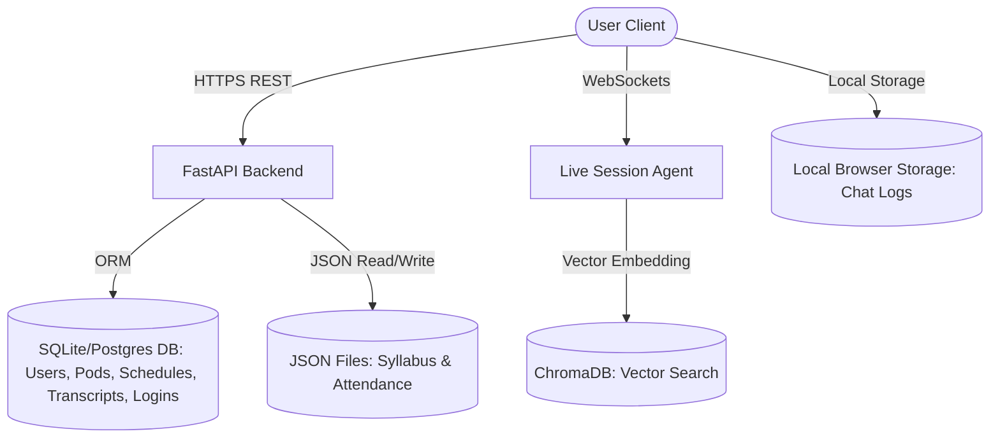

# Partner Specification

Partner is an educational platform designed to resolve the inefficiencies and cost issues of modern educational management systems. 

---

## 1. Overview & BYOK AI Model Philosophy
Partner is designed around a **Bring Your Own Key (BYOK)** model architecture (similar to Cursor and Partner). 
- **The Challenge**: Enterprise AI tutoring systems incur substantial, unpredictable token costs when scaled to entire university classes. This makes SaaS hosting costs extremely high.
- **The Solution**: Partner separates the user interface platform from the AI inference layers. Students and teachers supply their own API credentials (e.g., Gemini, OpenAI, Anthropic, or local Ollama). Students bear the direct API costs of their personalized AI tutors, and teachers bear the API costs of their AI teaching assistants (T.A.s). Partner remains highly cost-effective and competitive against locked-in products like Google Classroom.

---

## 2. Competitor Market Analysis

| Platform | Strengths | Gaps & Weaknesses | Partner Value Add |
| :--- | :--- | :--- | :--- |
| **Google Classroom** | Deep integration with Google Docs/Drive; simple interface; widely adopted. | Lacks native AI features; closed ecosystem; no real-time live lecture assistance. | Model-agnostic AI; interactive live sessions; visual roadmap-style syllabus tracking. |
| **Canvas LMS / Blackboard** | Highly robust; extensive grading, enrollment, and administrative systems. | Clunky, legacy user interfaces; expensive enterprise contracts; very slow to adopt AI. | Lightweight, modern glassmorphic UI; student-focused personalized AI tutoring. |
| **Cursor / Agentic IDEs** | Excellent AI-assistance using BYOK model. | Not designed for educational contexts (rosters, attendance, class syllabi, etc.). | Applies the successful BYOK paradigm directly to educational management. |

---

## 3. Financial Plan
Partner is positioned as a **SaaS platform with self-hosting options**:
1. **Core Platform Subscription (SaaS)**: Low-cost per-seat monthly tier for schools and teachers to host pods on Partner servers. Because AI token costs are paid by the users' own API keys, our hosting costs remain minimal, leaving high profit margins.
2. **Enterprise Self-Hosted License**: Universities can buy a license to self-host Partner on their own servers (Docker/Kubernetes) and connect to custom institutional identity providers.
3. **Premium Visual Templates & Integrations**: Premium add-ons, such as advanced analytics dashboards, automated grading connectors, and custom roadmaps.

---

## 4. Software Architecture & Data Storage

Partner uses a hybrid storage model to ensure privacy, performance, and low operational overhead:

### Data Storage Formats
- **Relational Databases (SQLite / PostgreSQL)**: Used for core structured tables:
  - `User`: Username, email, password hashes.
  - `Pod`: Semester, subject, references to JSON files.
  - `Schedule`: Class timings, locations, reschedule proposals.
  - `LoginLog`: User sign-in logs with IP, user agent, and timestamp.
  - `LiveSessionTranscript`: Transcripts and AI lecture recaps.
- **Hierarchical Flat Files (JSON)**: Used for rapid read/write of large structured trees:
  - `Syllabus`: Nested chapter-topic-subtopic objects.
  - `Attendance`: Roll numbers, names, and date-to-boolean attendance matrices.
- **Vector Database (ChromaDB)**: Used to index live session transcripts and classroom files to provide context-aware Retrieval-Augmented Generation (RAG) during student chats.
- **Local-First Browser Storage (localStorage/IndexedDB)**: Used for classroom chat logs. No messages are stored on the server, ensuring privacy and reducing server costs.

---

## 5. Technology Stack

- **Frontend**:
  - React 19 (Vite)
  - TailwindCSS (Vanilla utility classes with custom theme configuration)
  - Framer Motion (Transitions and animations)
  - Lucide React (Icons)
  - React Router DOM (Single-page app routing)
  - Google Identity Services (Client-side OAuth)
- **Backend**:
  - FastAPI (Asynchronous python server)
  - SQLAlchemy & SQLite / PostgreSQL (Relational DB)
  - PyJWT & Passlib (Secure tokens and hashing)
  - ChromaDB & LangChain (Vector index and LLM orchestration)
  - WebSockets (Live audio/text updates during lectures)
- **Deployment**:
  - Docker & local batch scripts (`start_partner.bat`)
